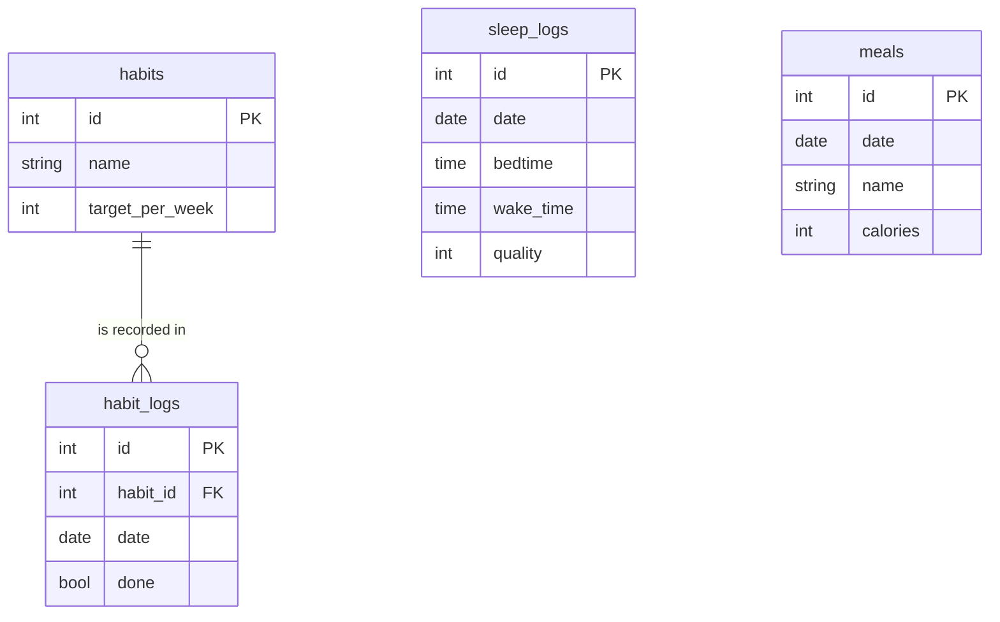

# Fitness Tracker

> Personal health & habit tracking Android app

**Status:** Active · **Access:** Public repository · [Source](https://github.com/Brian-Kareithi/Physical-Fitness)

## Purpose

Track sleep and diet in one Android app that stores everything on the device.

## Problem

Off-the-shelf fitness apps buried the two things I actually wanted to track, sleep and diet, under features I didn't need, so I built a Kotlin app scoped to exactly what I use daily.

## Target audience

| Audience | Needs |
| --- | --- |
| Me, as the daily user | Log sleep, meals and habits in seconds and see trends, without an account. |

## Scope

### In scope

- Sleep logging
- Meal and nutrition logging
- Habit tracking
- Progress charts

### Out of scope

- Cloud sync or accounts
- Social features
- Wearable integration

## Solution

1. Sleep tracking and habit monitoring with daily logging and progress charts
2. Diet and nutrition tracking with meal logging and health metrics
3. Local-first storage with Room Database, no account or backend required
4. Actively used and iterated on daily, driven by real usage rather than a spec

## Architecture

Android UI (Kotlin) → Room Database → Local Storage

## Data model

## Design priorities

- Local-first and private
- Fast daily entry
- Offline by design

## Technology

Kotlin · Android SDK · Room Database · MPAndroidChart

## My contribution

Solo personal project: designed, built and continue to maintain it.
