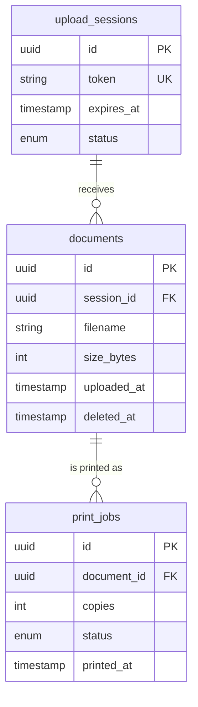

# QuickPrint

> QR-based document submission & printing platform

**Status:** Completed · **Access:** Public repository · [Source](https://github.com/Thee-Entity/QuickPrint-Client)

## Purpose

Replace flash drives at a cyber café with a phone-based upload that deletes itself after printing.

## Problem

Cyber café printing usually means handing a flash drive to a stranger's computer, a privacy risk and a slow workflow. QuickPrint replaces it with a self-service, ephemeral upload flow built for a single-till café.

## Target audience

| Audience | Needs |
| --- | --- |
| Café customers | Send a document to print from their own phone, without handing over a drive. |
| Café operator | A single queue at the till and no leftover customer files. |

## Scope

### In scope

- QR code that opens a temporary upload page
- Upload to a transient server
- Print queue for the till
- Automatic deletion after printing

### Out of scope

- Customer accounts
- Payment handling
- Multi-till or multi-branch support

## Solution

1. Customers scan a QR code to open a temporary upload portal on their own phone
2. Documents upload to a transient server, get printed, then are automatically deleted
3. No flash drives or shared storage, reducing the risk of files left behind
4. Built for the specific constraints of a single-till cyber café workflow

## Architecture

Client (QR Upload) → Express API → SQLite

Branch from *Express API*: Auto-delete Job.

## Data model

## Design priorities

- Privacy: nothing persists after the job
- Works on any phone browser, no install
- Simple enough for one operator

## Technology

React · Node.js · Express · SQLite · QR Code API

## My contribution

Designed and built end to end, from the QR upload flow to the ephemeral file lifecycle.
