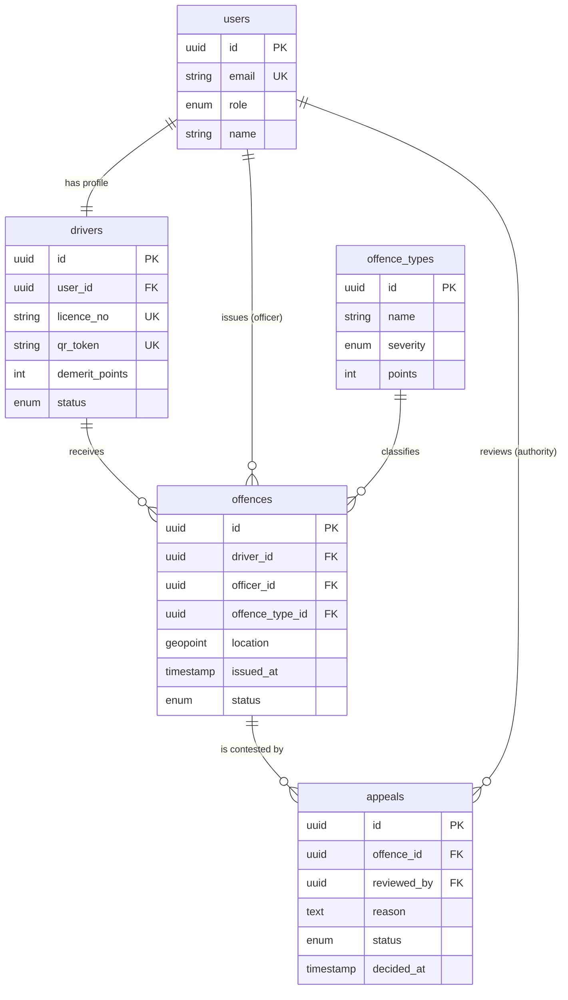

# RoadSafe360

> Road safety & driver demerit management platform

**Status:** Shipped · **Access:** Public repository · [Live demo](https://roadsafe-opal.vercel.app/auth) · [Source](https://github.com/Brian-Kareithi/RoadSafe360)

## Purpose

Give road authorities one auditable record of licences, offences, demerit points and appeals.

## Problem

Road authorities need a way to track driver licences, traffic offences and demerit points without paper trails or siloed records, and appeals need a transparent, auditable process. RoadSafe360 models that entire workflow end to end, from offence issuance through licence suspension to appeal resolution.

## Target audience

| Audience | Needs |
| --- | --- |
| Drivers | See licence status and demerit points, and contest an offence they believe is wrong. |
| Police officers | Issue an offence in the field and verify a licence by scanning its QR code. |
| Road authority | Review appeals and read regional safety trends to target enforcement. |
| System administrators | Manage accounts, roles and the offence catalogue. |

## Scope

### In scope

- Role-based access for four user types
- Digital licence with QR verification
- Offence issuance with severity-based demerit points
- Appeal submission, review and point restoration
- Regional analytics with charts and a map

### Out of scope

- Fine payment processing
- Integration with a live national licensing database
- Native mobile apps

## Solution

1. Role-based dashboards for drivers, police officers, road authorities and admins, each scoped to what that role needs
2. Digital licences with QR-code verification and automatic demerit point calculation
3. Traffic offence issuance and tracking, with point deductions tied to offence severity
4. An appeals workflow that lets drivers contest offences, with point restoration on approval
5. Regional road-safety analytics with interactive charts and a Leaflet map

## Architecture

Next.js Frontend → Firebase Auth → Firestore / Storage

Branch from *Firebase Auth*: Role-based Dashboards.

## Data model

## Design priorities

- Auditability of every point change
- Least-privilege access per role
- Responsive on field devices

## Technology

Next.js 16 · React 19 · TypeScript · Tailwind CSS 4 · Firebase · Recharts · Leaflet

## My contribution

Designed the data model and Firebase security rules, built the role-based dashboards, the QR licence and appeals workflow, and the map-based analytics view.
