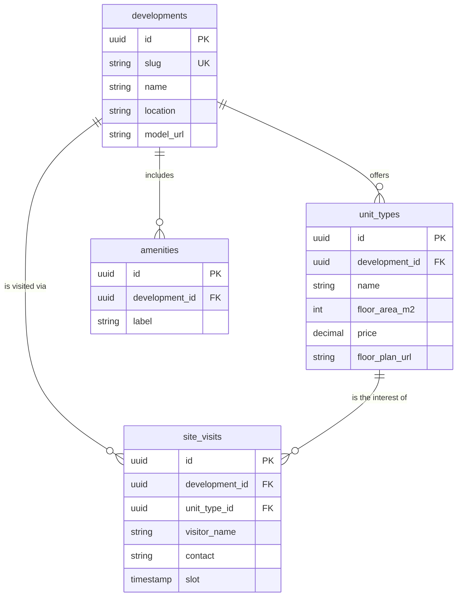

# Sapio Homes

> Real-estate development & property discovery platform

**Status:** Shipped · **Access:** Client project: source is proprietary · [Live demo](https://sapio-homes.vercel.app)

## Purpose

Let prospective buyers find a unit, see the building, and book a visit without a phone call.

## Problem

Sapio Homes needed a marketing and discovery site for its Nairobi apartment developments that could do more than list units: prospective buyers needed to filter by budget and floor area, visualise a building before it was finished, and book a site visit without a phone call.

## Target audience

| Audience | Needs |
| --- | --- |
| Prospective buyers | Filter by budget and floor area, preview the development, book a site visit. |
| Existing unit owners | Find the property management services on offer. |
| Sapio sales team | Receive qualified visit bookings with the unit of interest attached. |

## Scope

### In scope

- Search by unit type, budget and floor area
- 3D building viewer
- Site-visit booking per development
- Project pages with pricing, floor plans and amenities
- Property management service pages

### Out of scope

- Online payment or reservation deposits
- Customer account area
- Content management UI for the client

## Solution

1. Interactive property search filtered by unit type, budget and floor area
2. A 3D building viewer built with React Three Fiber so buyers can explore a development before visiting
3. Site-visit booking calendar integrated into each project page
4. Detailed project pages with pricing, floor plans and amenities
5. Property management service pages for existing unit owners

## Architecture

Next.js Frontend → Next.js API Routes → Three.js / R3F Viewer

Branch from *Next.js API Routes*: Booking & Property Data.

## Data model

## Design priorities

- Fast first load despite the 3D viewer
- Mobile-first browsing
- Accurate pricing data per unit

## Technology

Next.js 16 · TypeScript · Tailwind CSS v4 · Three.js · React Three Fiber · Framer Motion

## My contribution

Built as a client engagement: architected the site structure, implemented the 3D property viewer and the booking flow, and integrated pricing and floor-plan data per development.
