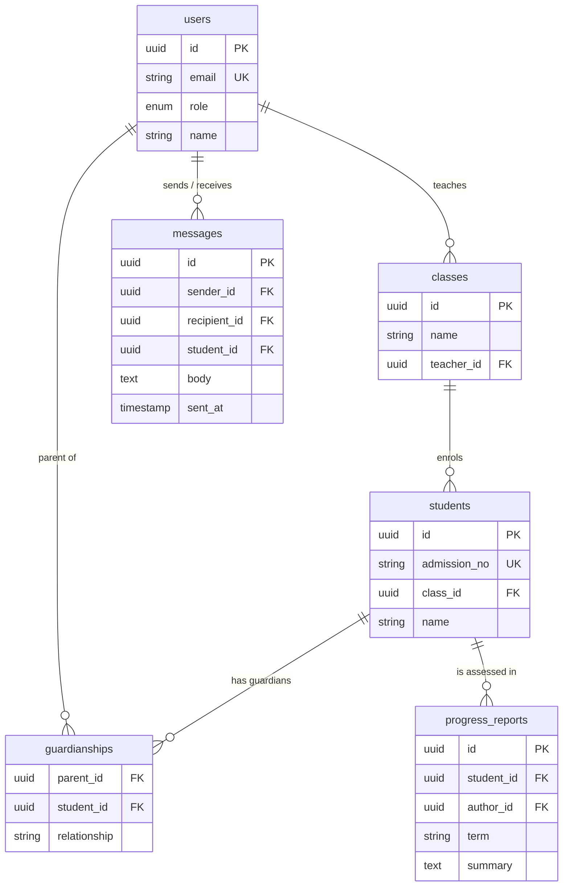

# Steadfast Parent Portal

> Education management platform for parents, teachers and students

**Status:** Active · **Access:** Private school system

## Purpose

Keep parents informed about a child's progress and in direct contact with teachers, on web and mobile.

## Problem

Steadfast Academy needed a way for parents to track a child's progress, communicate with teachers and stay engaged with school life, without relying on paper notices or ad hoc group chats, across both web and mobile.

## Target audience

| Audience | Needs |
| --- | --- |
| Parents and guardians | Follow progress and message teachers without paper notices or group chats. |
| Teachers | Record progress and reach parents from one place. |
| School administration | One system of record shared with the other academy tools. |

## Scope

### In scope

- Parent portal (web)
- Teacher portal (web)
- Companion mobile app (Android and iOS)
- Progress tracking and messaging via the backend API

### Out of scope

- Fee payment
- Timetable authoring
- Student-facing app

## Solution

1. Built a responsive Parent portal alongside the Teacher portal on the web
2. Integrated the frontend with backend APIs for progress tracking and communication
3. Built the companion mobile app with Expo / React Native for Android and iOS
4. Implemented academic engagement and communication workflows end to end

## Architecture

Next.js Web → Expo Mobile → Node.js API → PostgreSQL

## Data model

## Design priorities

- Child data privacy and access control
- Consistent behaviour across web and mobile
- Low-bandwidth tolerance on mobile

## Technology

Next.js · React Native · Expo · TypeScript · Node.js · PostgreSQL

## My contribution

Part of my role at Steadfast Academy: the web and mobile parent experience, the API integration, and coordination with the school's information systems.
